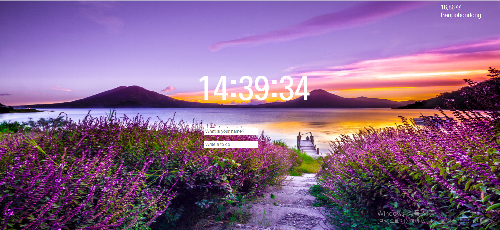
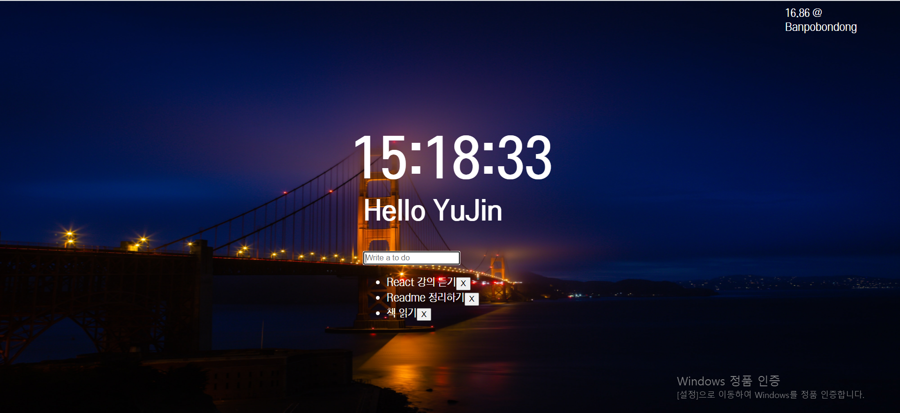

# 바닐라 자바스크립트 - Chrome Clone Coding  
### 바닐라 자바스크립트를 이용한 Chrome Momentum 웹페이지 제작   
### (2020.11.02 - 2020.11.12)     
[웹페이지 접속하기](https://yuujining.github.io/VanillaJS_ChromeApp/)
 

---

### 주요 기능 
* 사용자의 이름을 입력받고 Greetings 문구 제공  
* Open Weather API를 이용해 날씨 정보 제공    
* 간단한 To Do List 제공   
* 랜덤으로 바뀌는 배경사진
---    

### 소개 
* 처음 사이트 방문 - name 입력  

* User name과 ToDoList 입력   

